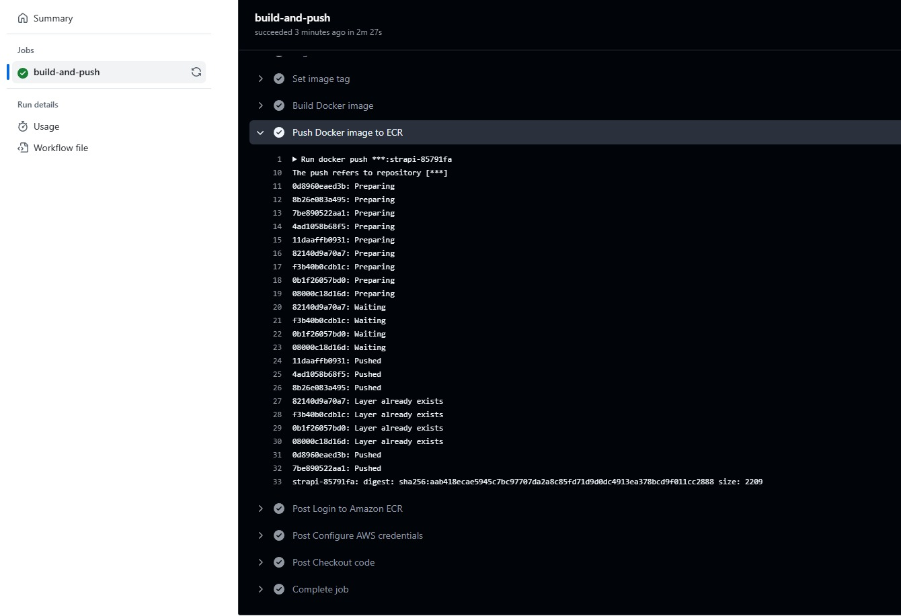
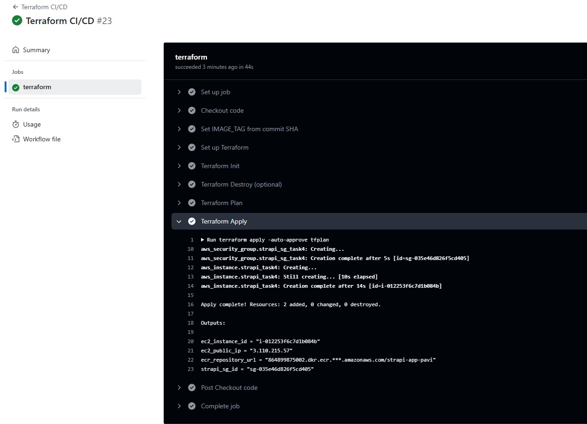
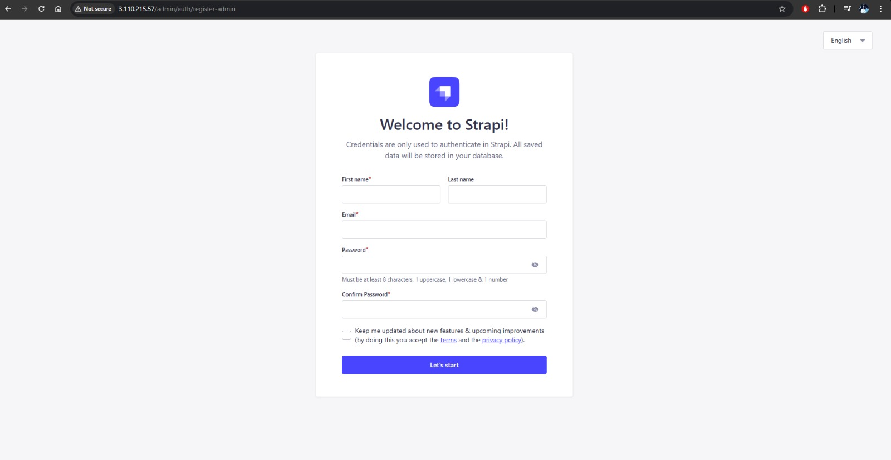

# Strapi Deployment Automation (GitHub Actions + Terraform)

## 📚 Project Overview

This project automates the deployment of a Strapi application using a CI/CD pipeline and infrastructure as code:

- **CI Pipeline**:  
  On every push to the `main` branch, GitHub Actions builds a Docker image of the Strapi app and pushes it to **AWS ECR**.
  
- **CD Pipeline**:  
  Deployment is triggered manually through GitHub Actions. Terraform provisions the infrastructure and pulls the latest Docker image to run on an **EC2 instance** over SSH.

- **Deployment Verification**:  
  The Strapi application is accessed via the EC2 instance's public IP to ensure successful deployment.

## ⚡ Key Highlights

- Automated Docker image build and push with GitHub Actions.
- Infrastructure deployment and container launch using Terraform.
- AWS ECR used for storing Docker images.
- EC2 instance used for running the Strapi container.
- Manual control over production deployments through GitHub Actions `workflow_dispatch`.

 

**CI PIPELINE SUCCESS** 

   

 
 **CD PIPELINE SUCCESS**

 
   

 **STRAPI APPLICATION LIVE** 
 
   

 

## ✅ Summary

This project simplifies Strapi deployment by combining containerization, GitHub Actions workflows, and Terraform infrastructure management. It ensures a smooth, repeatable, and scalable deployment process with minimal manual steps.
